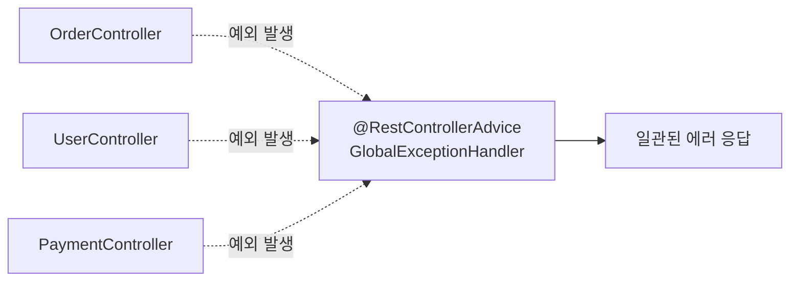

#CS #Spring #면접

관련: [[Spring]] · [[../Infrastructure/RESTful API|RESTful API]] · [[../Java/예외 처리|예외 처리]]

## 목차
- [[#왜 전역으로 처리해야 할까? — 컨트롤러마다 반복되는 try-catch]]
- [[#@ExceptionHandler — 컨트롤러 하나의 예외 처리]]
- [[#@ControllerAdvice — 모든 컨트롤러의 예외를 한 곳에서]]
- [[#일관된 에러 응답 형식 만들기]]
- [[#특정 예외를 특정 상태 코드로 — @ResponseStatus]]
- [[#한 장 요약]]
- [[#Q&A로 복습하기]]

---

## 왜 전역으로 처리해야 할까? — 컨트롤러마다 반복되는 try-catch

REST API를 만들다 보면, 컨트롤러마다 이런 코드가 반복되기 쉬워요.

```java
@GetMapping("/orders/{id}")
ResponseEntity<?> getOrder(@PathVariable Long id) {
    try {
        Order order = orderService.findById(id);
        return ResponseEntity.ok(order);
    } catch (OrderNotFoundException e) {
        return ResponseEntity.status(404).body(e.getMessage()); // 이 패턴이 모든 컨트롤러에 반복됨
    } catch (Exception e) {
        return ResponseEntity.status(500).body("서버 오류");
    }
}
```

컨트롤러 하나하나에 이런 `try-catch`를 넣으면, **핵심 로직이 예외 처리 코드에 파묻히고**, 에러 응답 형식도 컨트롤러마다 조금씩 달라지기 쉬워요. Spring은 이 반복을 [[Spring]]에서 다룬 **AOP**와 비슷한 방식으로 해결해요 — **예외 처리 로직을 컨트롤러 밖으로 완전히 분리**하는 거예요.

---

## @ExceptionHandler — 컨트롤러 하나의 예외 처리

가장 기본적인 단위는 `@ExceptionHandler`예요. 특정 컨트롤러 안에서, **특정 예외가 발생하면 이 메서드가 대신 처리**하도록 등록해요.

```java
@RestController
class OrderController {

    @GetMapping("/orders/{id}")
    Order getOrder(@PathVariable Long id) {
        return orderService.findById(id); // try-catch 없이 그냥 예외를 던지기만 함
    }

    @ExceptionHandler(OrderNotFoundException.class) // 이 컨트롤러에서 이 예외가 나면 여기로
    ResponseEntity<String> handleNotFound(OrderNotFoundException e) {
        return ResponseEntity.status(404).body(e.getMessage());
    }
}
```

`getOrder()`는 이제 예외 처리를 전혀 신경 쓰지 않고, **그냥 예외를 던지기만 하면** 돼요. Spring이 `OrderNotFoundException`이 발생한 걸 감지해서, 같은 클래스 안의 `handleNotFound()`로 자동으로 라우팅해줘요.

---

## @ControllerAdvice — 모든 컨트롤러의 예외를 한 곳에서

`@ExceptionHandler`를 컨트롤러마다 반복해서 넣는 것도 여전히 중복이에요. `@ControllerAdvice`(REST API라면 `@RestControllerAdvice`)를 쓰면, **애플리케이션 전체의 예외 처리를 한 클래스에 모을 수 있어요.**

```java
@RestControllerAdvice // 모든 @RestController에 공통 적용
class GlobalExceptionHandler {

    @ExceptionHandler(OrderNotFoundException.class)
    ResponseEntity<ErrorResponse> handleOrderNotFound(OrderNotFoundException e) {
        return ResponseEntity.status(404).body(new ErrorResponse("ORDER_NOT_FOUND", e.getMessage()));
    }

    @ExceptionHandler(IllegalArgumentException.class)
    ResponseEntity<ErrorResponse> handleInvalidArgument(IllegalArgumentException e) {
        return ResponseEntity.status(400).body(new ErrorResponse("INVALID_ARGUMENT", e.getMessage()));
    }

    @ExceptionHandler(Exception.class) // 나머지 처리 안 된 예외는 전부 여기로 (최후의 안전망)
    ResponseEntity<ErrorResponse> handleUnknown(Exception e) {
        log.error("예상치 못한 오류", e);
        return ResponseEntity.status(500).body(new ErrorResponse("INTERNAL_ERROR", "서버 오류가 발생했습니다"));
    }
}
```



이제 모든 컨트롤러의 `getOrder()`, `getUser()` 같은 메서드들은 **비즈니스 로직에만 집중**하고, "이 예외가 발생하면 어떤 상태 코드와 메시지로 응답할지"는 **이 클래스 하나가 전담**해요. [[../Java/예외 처리|예외 처리]]에서 다룬 커스텀 예외들을 여기서 각각 알맞은 [[../Infrastructure/RESTful API|RESTful API]] 상태 코드로 매핑하는 거예요.

---

## 일관된 에러 응답 형식 만들기

여러 예외를 처리하더라도, **에러 응답의 형식(JSON 구조)은 통일**하는 게 좋아요. 그래야 API를 쓰는 클라이언트가 에러를 항상 같은 방식으로 파싱할 수 있어요.

```java
record ErrorResponse(String code, String message) {} // 모든 에러 응답이 이 형식을 따름
```

```json
{
  "code": "ORDER_NOT_FOUND",
  "message": "주문을 찾을 수 없습니다. id=123"
}
```

`code`처럼 **기계가 읽고 분기 처리하기 좋은 값**과, `message`처럼 **사람이 읽기 좋은 값**을 함께 두는 게 실무에서 흔한 패턴이에요.

---

## 특정 예외를 특정 상태 코드로 — @ResponseStatus

간단한 경우엔, 예외 클래스 자체에 `@ResponseStatus`를 붙여서 **"이 예외가 발생하면 무조건 이 상태 코드로 응답하라"** 고 정의할 수도 있어요.

```java
@ResponseStatus(HttpStatus.NOT_FOUND) // 이 예외가 던져지면 자동으로 404 응답
class OrderNotFoundException extends RuntimeException {
    public OrderNotFoundException(Long orderId) {
        super("주문을 찾을 수 없습니다. id=" + orderId);
    }
}
```

이 방식은 간단하지만, **응답 본문(body)의 형식을 세밀하게 커스터마이징하기는 어려워요.** 그래서 실무에서는 보통 **응답 형식을 통일해서 관리하고 싶을 땐 `@RestControllerAdvice`, 정말 단순한 경우에만 `@ResponseStatus`** 를 쓰는 식으로 나눠 써요.

---

## 한 장 요약

| 질문 | 답 |
|---|---|
| 왜 전역 예외 처리가 필요한가? | 컨트롤러마다 반복되는 try-catch를 없애고 에러 응답 형식을 일관되게 유지하기 위해 |
| @ExceptionHandler의 범위는? | 같은 클래스(컨트롤러) 안에서만 적용 |
| @ControllerAdvice의 범위는? | 애플리케이션 전체 컨트롤러에 공통 적용 |
| 에러 응답 형식을 통일하는 이유는? | 클라이언트가 항상 같은 구조로 에러를 파싱할 수 있게 하기 위해 |
| @ResponseStatus는 언제 쓰나? | 응답 본문 커스터마이징 없이 단순히 상태 코드만 지정하고 싶을 때 |

---

## Q&A로 복습하기

### Q. 컨트롤러마다 try-catch로 예외를 처리하는 방식의 문제점은?
A. 예외 처리 코드가 반복되어 핵심 비즈니스 로직이 묻히고, 컨트롤러마다 에러 응답 형식이 조금씩 달라질 위험이 있다.

### Q. @ExceptionHandler와 @ControllerAdvice의 적용 범위 차이는?
A. @ExceptionHandler는 같은 클래스(주로 하나의 컨트롤러) 안에서만 적용되지만, @ControllerAdvice(@RestControllerAdvice)는 애플리케이션의 모든 컨트롤러에 공통으로 적용되어 예외 처리를 한 곳에 모을 수 있다.

### Q. 전역 예외 처리기에서 Exception.class를 처리하는 핸들러를 따로 두는 이유는?
A. 미처 예상하지 못한 종류의 예외까지 안전하게 잡아 일관된 형식의 500 에러로 응답하기 위한 최후의 안전망 역할을 하기 위해서다.

### Q. 에러 응답에 code와 message를 함께 두는 이유는?
A. code는 클라이언트(프론트엔드 등)가 프로그램적으로 분기 처리하기 좋고, message는 사람이 읽고 이해하기 좋아, 두 목적을 함께 만족시키기 위해서다.

### Q. @ResponseStatus와 @RestControllerAdvice 중 언제 무엇을 쓰는 것이 적합한가?
A. 응답 본문을 세밀하게 커스터마이징할 필요 없이 단순히 특정 예외에 상태 코드만 지정하고 싶다면 @ResponseStatus가 간단하고, 에러 응답 형식을 통일적으로 관리하고 싶다면 @RestControllerAdvice가 더 적합하다.
