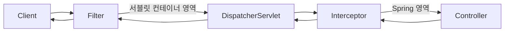

#CS #Spring #면접

관련: [[Spring]] · [[서블릿]] · [[../Fundamentals/인증과 인가|인증과 인가]]

## 목차
- [[#둘 다 "요청을 가로채는 녀석"인데 뭐가 다를까?]]
- [[#요청이 지나가는 전체 경로]]
- [[#Filter 코드로 보기]]
- [[#Interceptor 코드로 보기]]
- [[#한눈에 비교]]
- [[#그래서 언제 뭘 써야 할까?]]
- [[#한 장 요약]]
- [[#Q&A로 복습하기]]

---

## 둘 다 "요청을 가로채는 녀석"인데 뭐가 다를까?

로그인 안 한 사용자를 막거나, 모든 요청의 로그를 남기고 싶을 때 — 매 컨트롤러마다 똑같은 코드를 반복해서 넣는 건 비효율적이에요. **필터(Filter)** 와 **인터셉터(Interceptor)** 는 둘 다 "컨트롤러에 도달하기 전에 요청을 가로채서 공통 작업을 처리"한다는 점에서 비슷해 보이지만, **동작하는 위치와 소속이 완전히 달라요.**

> 비유: 콘서트장에 들어가는 과정을 생각해보세요. **필터는 "건물 정문 보안 검색대"** 예요 — 콘서트장(Spring)이 아니라 건물(웹 애플리케이션 서버) 자체의 보안 요원이라, 티켓이 콘서트용인지 뮤지컬용인지(Spring인지 아닌지)는 관심 없어요. 그냥 위험 물품만 체크해요. **인터셉터는 "공연장 입구의 좌석 안내원"** 이에요 — 이미 건물 안(Spring 내부)에 들어온 사람들을 대상으로, "이 사람이 이 자리(컨트롤러)에 앉을 자격이 있는지" 좀 더 공연 특화된 체크를 해줘요.

---

## 요청이 지나가는 전체 경로



핵심은 **Filter는 `DispatcherServlet` 바깥(서블릿 컨테이너 레벨)에서 동작**하고, **Interceptor는 `DispatcherServlet` 안쪽(Spring 레벨)에서 동작**한다는 점이에요.

- **Filter**: 자바 서블릿(Servlet, [[서블릿]] 참고) 표준 스펙의 일부. Spring이 없는 순수 서블릿 애플리케이션에서도 쓸 수 있어요. Spring이 아예 등장하기 "전" 단계에서 동작해요.
- **Interceptor**: Spring이 제공하는 기능. `DispatcherServlet`이 컨트롤러를 호출하기 직전/직후에 끼어들어요. 그래서 Spring이 관리하는 Bean(예: Service)에 자유롭게 접근할 수 있어요.

---

## Filter 코드로 보기

```java
public class LoggingFilter implements Filter {
    @Override
    public void doFilter(ServletRequest request, ServletResponse response, FilterChain chain)
            throws IOException, ServletException {
        System.out.println("요청 시작: " + ((HttpServletRequest) request).getRequestURI());

        chain.doFilter(request, response); // ⭐ 다음 필터 or DispatcherServlet으로 넘김

        System.out.println("응답 완료");
    }
}
```

- `chain.doFilter(...)`를 호출해야 다음 단계로 넘어가요. 이걸 호출 안 하면 요청이 거기서 멈춰버려요 (예: 인증 실패 시 여기서 막고 바로 응답).
- 주로 하는 일: 인코딩 설정(문자셋), CORS 처리, XSS 방어, 요청/응답 압축, 전역 로깅 등 — **Spring이든 아니든 상관없는, 웹 애플리케이션 전반에 필요한 저수준 작업**.

## Interceptor 코드로 보기

```java
public class AuthInterceptor implements HandlerInterceptor {
    @Override
    public boolean preHandle(HttpServletRequest request, HttpServletResponse response, Object handler) {
        System.out.println("컨트롤러 실행 전"); // 로그인 체크 등
        return true; // false를 반환하면 여기서 요청이 중단됨 (컨트롤러 실행 안 됨)
    }

    @Override
    public void postHandle(HttpServletRequest request, HttpServletResponse response, Object handler, ModelAndView mv) {
        System.out.println("컨트롤러 실행 후, View 렌더링 전");
    }

    @Override
    public void afterCompletion(HttpServletRequest request, HttpServletResponse response, Object handler, Exception ex) {
        System.out.println("View 렌더링까지 완료된 후 (요청 처리 최종 완료)");
    }
}
```

- `preHandle`: 컨트롤러 실행 **전**. `false`를 반환하면 컨트롤러가 아예 호출되지 않고 요청이 끝나요.
- `postHandle`: 컨트롤러 실행 **후**, View를 그리기 전. (예외가 발생하면 호출 안 됨)
- `afterCompletion`: 응답이 완전히 끝난 후. 예외 발생 여부와 상관없이 항상 호출돼서, 리소스 정리나 로깅에 적합.
- 주로 하는 일: 로그인/인증 체크, 권한(Role) 검사, 컨트롤러 호출 관련 로깅 — **어떤 컨트롤러/핸들러가 호출되는지 알아야 하는, Spring 맥락이 필요한 작업**.

---

## 한눈에 비교

| 구분             | Filter                                | Interceptor                             |
| -------------- | ------------------------------------- | --------------------------------------- |
| 소속             | 서블릿 컨테이너 (Java EE 표준)                 | Spring                                  |
| 동작 위치          | `DispatcherServlet` **이전/이후**         | `DispatcherServlet`과 **Controller 사이**  |
| Spring Bean 접근 | 원칙적으론 어려움 (설정 필요)                     | 자유롭게 접근 가능 (Spring 컨텍스트 안이라서)           |
| 등록 방법          | `web.xml` 또는 `FilterRegistrationBean` | `WebMvcConfigurer`의 `addInterceptors()` |
| 세밀한 제어         | 요청 전체 단위 (URL 패턴 정도)                  | 어떤 컨트롤러/메서드가 호출되는지까지 알 수 있음             |
| 주로 쓰는 용도       | 인코딩, CORS, 보안(XSS), 압축 등 저수준 공통 처리    | 인증/인가, 로깅(비즈니스 컨텍스트 포함)                 |

---

## 그래서 언제 뭘 써야 할까?

- **"Spring이 뭔지 몰라도 되는, 웹 서버 차원의 공통 처리"** → Filter (예: 모든 요청/응답의 인코딩을 UTF-8로 통일, CORS 헤더 세팅)
- **"어떤 컨트롤러가 호출되는지 알아야 하거나, Spring Bean(Service 등)이 필요한 처리"** → Interceptor (예: "이 API는 관리자만 접근 가능" 같은 인가 로직에서 `UserService` Bean을 조회해야 하는 경우)

실무에서는 보통 **인증(로그인 여부) 자체는 Filter나 Spring Security**에서, **좀 더 세밀한 인가(권한) 로직은 Interceptor**에서 처리하는 조합을 많이 씁니다.

---

## 한 장 요약

| 질문 | 답 |
|---|---|
| 둘의 가장 큰 차이는? | 동작 위치 — Filter는 DispatcherServlet 밖(서블릿), Interceptor는 안(Spring) |
| Spring Bean에 더 자유롭게 접근 가능한 쪽은? | Interceptor |
| 요청을 중간에 막고 싶을 때 | Filter는 `chain.doFilter()`를 호출 안 함, Interceptor는 `preHandle`에서 `false` 반환 |
| 대표 용도 | Filter = 인코딩/CORS/보안, Interceptor = 인증/인가/로깅 |

---

## Q&A로 복습하기

### Q. Filter와 Interceptor 중 어느 게 먼저 실행되나?
A. Filter가 먼저다. Filter는 DispatcherServlet 바깥(서블릿 컨테이너)에서, Interceptor는 DispatcherServlet 안쪽(Spring)에서 동작하기 때문이다.

### Q. 둘 중 Spring Bean에 더 자유롭게 접근할 수 있는 건?
A. Interceptor다. Spring 컨텍스트 안에서 동작하기 때문에 Service 같은 Bean을 자유롭게 쓸 수 있다.

### Q. Interceptor에서 요청을 중간에 막으려면?
A. `preHandle()`에서 `false`를 반환하면 컨트롤러가 호출되지 않고 요청이 그대로 끝난다.

### Q. Filter에서 요청을 다음 단계로 넘기려면?
A. `chain.doFilter()`를 호출해야 한다. 호출하지 않으면 요청이 거기서 멈춘다.

### Q. 인코딩/CORS 처리와 로그인 인증 체크는 각각 Filter, Interceptor 중 뭘로 하는 게 자연스러운가?
A. 인코딩/CORS처럼 Spring인지 몰라도 되는 저수준 공통 처리는 Filter로, 어떤 컨트롤러가 호출되는지 알아야 하거나 Spring Bean이 필요한 처리는 Interceptor로 하는 게 자연스럽다.
